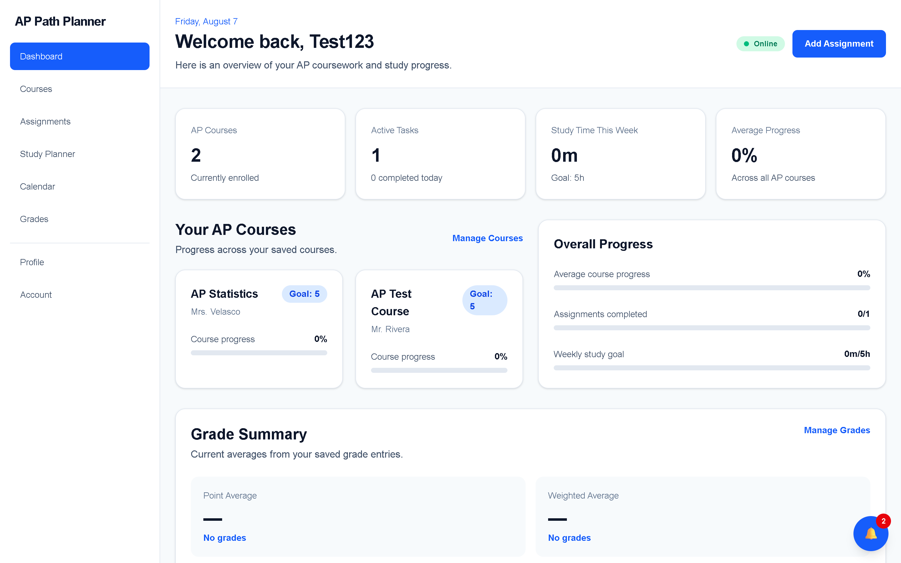
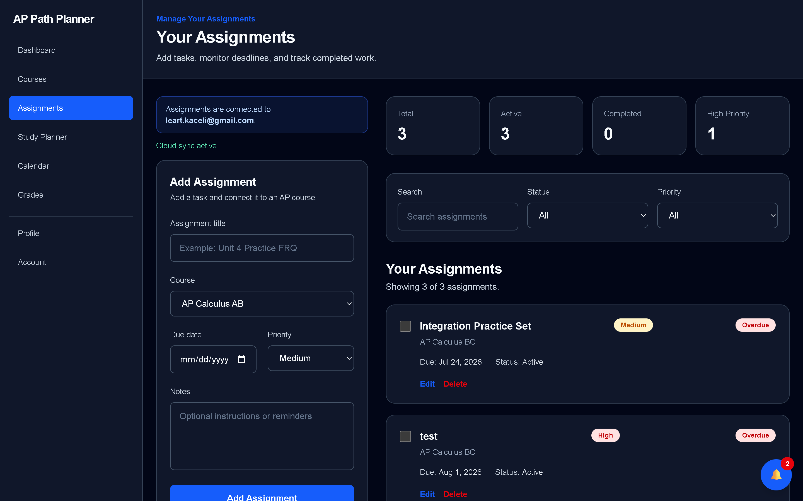
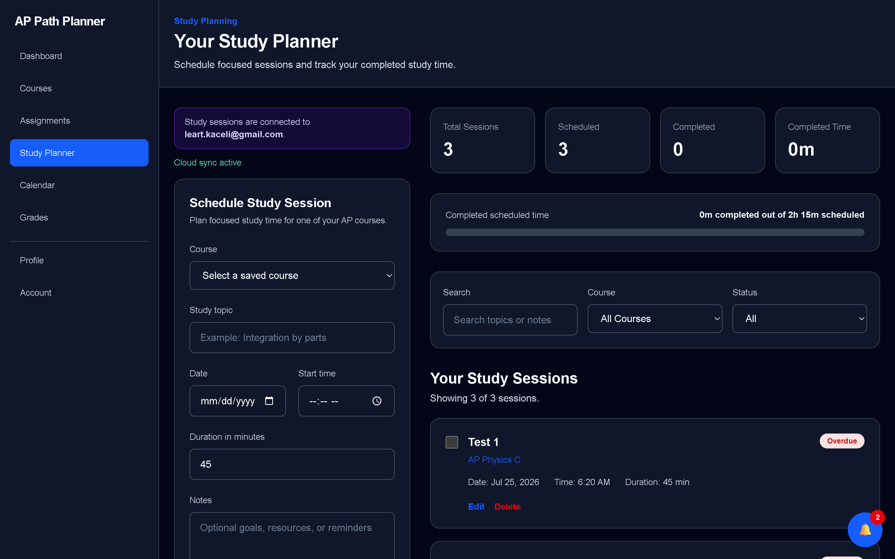
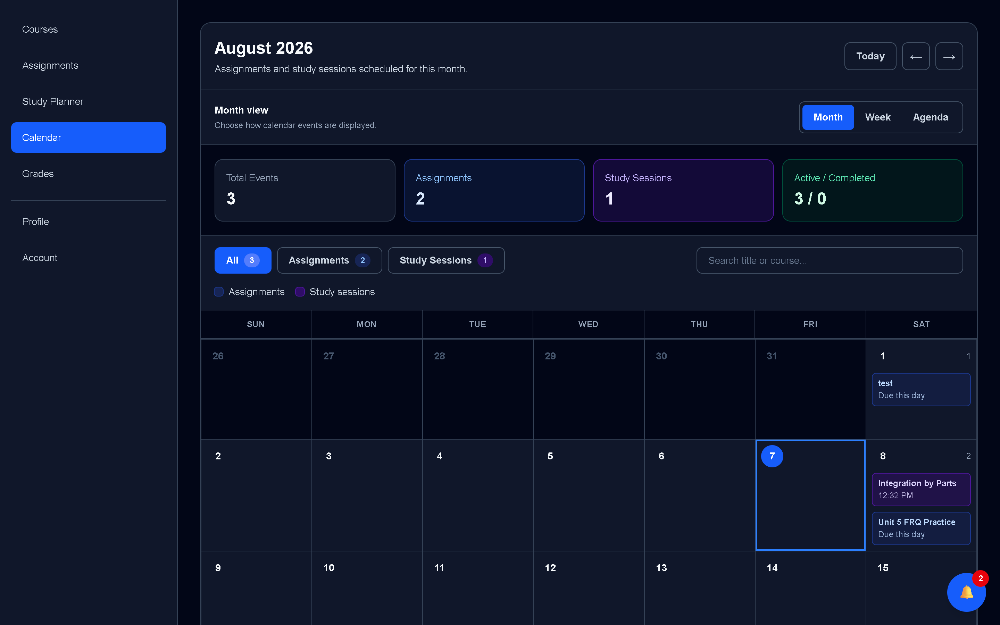

# AP Path Planner

AP Path Planner is a full-stack academic planning platform designed to help AP students organize courses, assignments, study sessions, grades, goals, calendars, reminders, and profile settings in one application.

I built the project with Next.js, TypeScript, React, Firebase, Playwright, GitHub Actions, and Vercel. The project includes authentication, private per-user data, Firestore Security Rules, automated testing, accessibility checks, emulator testing, and deployed smoke testing.

## Live Demo

Live application:

[Open AP Path Planner](https://ap-path-planner.vercel.app)

### Current Status

AP Path Planner is deployed and actively being improved. The next stage of the project is gathering feedback from real students and using that feedback to guide future releases.

## Screenshots

### Dashboard



### Assignment Tracking



### Study Planner



### Calendar



## Overview

AP students often manage coursework across multiple disconnected tools. Assignments may be stored in a school portal, study plans in a notebook, grades somewhere else, and reminders in a calendar.

AP Path Planner brings these areas into one application so that students can more easily understand upcoming responsibilities, plan study time, and track academic progress.

The project also became an opportunity for me to work through the complete software-development process:

1. Identify a practical problem
2. Plan the product
3. Design the interface
4. Build reusable components
5. Add authentication
6. Store and synchronize private cloud data
7. Write Firestore Security Rules
8. Add automated testing
9. Improve accessibility
10. Configure production deployment
11. Verify the deployed application

## Features

### Authentication

- Account creation
- Sign in
- Persistent authenticated sessions
- Sign out
- Account deletion

### Course Management

- Add courses
- Edit courses
- Delete courses
- Track AP course information and goals

### Assignment Management

- Create assignments
- Associate assignments with courses
- Add due dates
- Set priorities
- Mark assignments complete
- Edit and delete assignments

### Study Planner

- Create study sessions
- Choose a course
- Add a study topic
- Select date and start time
- Set session duration
- View scheduled sessions

### Calendar

- View assignments by date
- View planned study sessions
- Understand upcoming academic workload

### Grade Tracking

- Record earned and possible points
- Organize entries by course or category
- Monitor academic performance

### Profile and Preferences

- Display name
- School
- Graduation year
- Weekly study goal
- Theme preferences
- Reminder preferences
- Browser-notification preferences

### Data Management

- Export application data
- Clear planning data while keeping the login account
- Permanently delete the account

### Appearance

- Light theme
- Dark theme
- System theme

## Technology Stack

### Frontend

- Next.js
- React
- TypeScript
- Tailwind CSS

### Authentication and Data

- Firebase Authentication
- Cloud Firestore
- Firestore Security Rules
- Firebase Emulator Suite

### Testing

- Vitest
- Playwright
- Firebase Rules Testing
- Accessibility testing
- Visual regression testing
- Production smoke testing
- Deployed-site testing

### Development and Deployment

- Git
- GitHub
- GitHub Actions
- npm
- Vercel

## Architecture

AP Path Planner uses a client-focused architecture built around Next.js and Firebase.

```text
Student
  |
  v
Next.js / React interface
  |
  v
Firebase Authentication
  |
  v
Cloud Firestore
  |
  v
Firestore Security Rules
```

### Application Layers

1. **Presentation Layer**  
   Next.js pages and React components render dashboards, forms, calendars, profile settings, navigation, and status information.

2. **Service Layer**  
   Service and utility modules manage loading, saving, normalization, synchronization, deletion, and other application behavior.

3. **Authentication Layer**  
   Firebase Authentication identifies the current user.

4. **Data Layer**  
   Cloud Firestore stores private planning records.

5. **Security Layer**  
   Firestore Security Rules validate ownership and accepted document values.

6. **Testing Layer**  
   Unit, Rules, browser, accessibility, production, and deployed tests verify different parts of the system.

## Data Organization

Private application data is organized beneath the authenticated user's Firebase UID.

A simplified structure is:

```text
users/{userId}
├── courses/{courseId}
├── assignments/{assignmentId}
├── studySessions/{sessionId}
├── grades/{gradeId}
└── profile / settings data
```

Firestore Security Rules verify that the authenticated user matches the user path before allowing access to private records.

## Testing

AP Path Planner uses several test layers because no single test type can verify the entire application.

### Unit and Utility Tests

Vitest checks isolated logic and utility behavior.

```bash
npm run test
```

Coverage:

```bash
npm run test:coverage
```

### Firestore Security Rules Tests

Rules tests verify allowed and denied database operations against the Firestore emulator.

```bash
npm run test:rules
```

These tests verify behaviors such as:

- Signed-out users cannot access private records
- Users can access their own data
- Users cannot access another user's data
- Invalid values are rejected
- Valid owned records can be deleted

### Authenticated End-to-End Tests

Playwright uses Firebase emulators and a saved authenticated browser state to test real workflows.

```bash
npm run test:e2e:emulator
```

Example workflows include:

- Creating a course
- Editing a course
- Deleting a course
- Creating assignments
- Navigating authenticated pages

### Accessibility Tests

Playwright and automated accessibility checks detect serious accessibility problems such as insufficient contrast or missing accessible labels.

### Production Tests

The application is built and started in production mode before browser checks run.

```bash
npm run test:production
```

### Deployed Smoke Tests

A separate workflow can verify a real Vercel deployment.

These tests confirm that the deployed application is actually AP Path Planner and that important pages, metadata, navigation, and production behavior work correctly.

## Continuous Integration

GitHub Actions automatically runs important quality checks when code is pushed.

The CI workflow includes tasks such as:

- Install dependencies
- Run ESLint
- Run unit tests
- Run coverage
- Start Firebase emulators
- Run Firestore Rules tests
- Build the production application
- Run authenticated Playwright tests
- Upload useful failure reports and artifacts

A separate deployed-smoke workflow can test a Vercel deployment URL after deployment.

## Local Setup

### Requirements

- Node.js 22
- npm
- Java for Firebase emulators
- Firebase CLI

### Clone the Repository

```bash
git clone https://github.com/Leart-Kaceli/AP-Path-Planner
cd AP-Path-Planner
```

### Install Dependencies

```bash
npm ci
```

### Start Local Development

```bash
npm run dev
```

Then open:

```text
http://localhost:3000
```

## Environment Variables

Create a `.env.local` file in the project root.

Example:

```text
NEXT_PUBLIC_FIREBASE_API_KEY=your_firebase_web_api_key
NEXT_PUBLIC_FIREBASE_AUTH_DOMAIN=your-project.firebaseapp.com
NEXT_PUBLIC_FIREBASE_PROJECT_ID=your-project-id
NEXT_PUBLIC_FIREBASE_STORAGE_BUCKET=your-project.firebasestorage.app
NEXT_PUBLIC_FIREBASE_MESSAGING_SENDER_ID=your_sender_id
NEXT_PUBLIC_FIREBASE_APP_ID=your_app_id
NEXT_PUBLIC_SITE_URL=http://localhost:3000
NEXT_PUBLIC_USE_FIREBASE_EMULATORS=false
```

Never commit real private environment values or deployment secrets.

## Firebase Emulator Setup

AP Path Planner uses the Firebase Emulator Suite for local authentication, Firestore, and Security Rules testing.

The test environment uses the demo project:

```text
demo-ap-path-planner
```

To run the Firestore Rules tests:

```bash
npm run test:rules
```

To run authenticated browser tests against Firebase emulators:

```bash
npm run test:e2e:emulator
```

The emulator test environment is intentionally separated from production so automated tests do not modify real user data.

## Production Build

Create a production build:

```bash
npm run build
```

Start the built application:

```bash
npm run start
```

Run production browser tests using the project's production-test script:

```bash
npm run test:production
```

## Deployment

AP Path Planner is deployed with Vercel.

Production and Preview deployments use environment variables configured through Vercel.

The deployment setup also includes checks for:

- Correct application identity
- Public metadata
- Navigation
- Security headers
- Accessibility
- Production behavior
- Deployed smoke testing

Firestore Security Rules are deployed separately through Firebase.

## Project Structure

```text
src/
├── app/
├── components/
├── constants/
├── hooks/
├── lib/
├── services/
├── types/
└── utils/

e2e/
├── authenticated/
├── visual/
├── helpers/
└── auth.setup.ts

tests/
└── firestore.rules.test.mjs

.github/
└── workflows/

firestore.rules
firebase.json
playwright.config.ts
```

## Technical Challenges

### Authenticated Browser Testing

Reliable Playwright testing required a predictable Firebase emulator account, saved authentication state, matching user IDs, clean Firestore data, and controlled test execution.

Several visible failures initially looked like assignment or course bugs but were actually caused by authentication state, emulator setup, data paths, or Security Rules.

### Persistence and Synchronization

A record could appear immediately in the interface before its Firestore write was fully confirmed.

This required distinguishing between local state, cached data, pending writes, emulator data, and confirmed persisted data.

### Firestore Security Rules Testing

Security Rules tests required careful setup and cleanup. I learned to use trusted setup contexts only for controlled test data while still testing normal user access through Security Rules.

### Deployment Environments

Local development, Firebase emulators, local production builds, Vercel Preview, and Vercel Production could behave differently.

Deployed smoke tests initially reached Vercel's access page instead of AP Path Planner, producing misleading failures until the deployment testing setup was corrected.

### Accessibility

Automated checks found issues such as insufficient text contrast that were not obvious during manual use.

This reinforced the importance of measuring accessibility rather than judging it only by appearance.

## What I Learned

Building AP Path Planner taught me that production software involves much more than creating visible features.

Some of the most important lessons were:

- Authentication must match database ownership
- Firestore Security Rules need independent testing
- Browser tests require controlled setup and cleanup
- Real-time cloud data can have multiple states
- Local and deployed environments can behave differently
- Accessibility needs deliberate testing
- Documentation makes debugging easier
- The first visible error is not always the root cause
- Large projects become manageable when they are divided into smaller tasks

## Future Improvements

Planned or possible improvements include:

- Google Calendar integration
- Recurring assignments
- Recurring study sessions
- Better first-use onboarding
- Improved notification scheduling
- Continued mobile improvements
- AI-assisted study planning
- More student feedback
- Additional privacy-conscious analytics
- Stronger production security policies

## Privacy and Data

AP Path Planner stores private planning information under authenticated user accounts.

The project uses:

- Firebase Authentication
- Per-user Firestore data paths
- Firestore Security Rules
- Data export controls
- Application-data clearing
- Permanent account deletion

The application is designed so that users do not need to expose academic planning data publicly.

---

Built as a long-term software-engineering project focused on full-stack development, security, testing, accessibility, deployment, and student productivity.